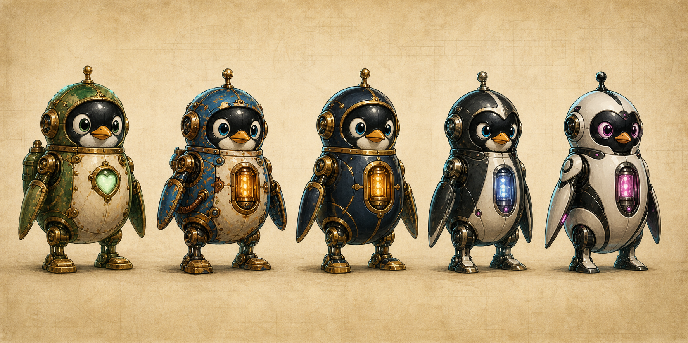

# The Path of Least Resistance

A heartfelt four-button arcade puzzle-racer about an obsolete mechanical penguin proving that kindness is not a legacy defect.

[Play The Path of Least Resistance](https://boneshaman.github.io/path-of-least-resistance/)



## What I Made

You play as Noderunner 3000, an older wire-running machine whose job was taken by faster and increasingly hostile successor models.

Each duel alternates between:

- High-pressure three-lane running
- Jumping, lane dodging, and electrical belly-slides
- Chainable Flow speed boosts
- Competitive shortest-path sliding puzzles
- Two race legs against a physical rival

Both racers share one checkpoint timeline with front-facing model portraits, so the chase can be read at a glance during both running and OHM puzzles. Story exchanges reveal one speaker at a time instead of presenting the entire conversation simultaneously.

The complete campaign faces Noderunners `3200`, `3600`, and `4000`. Each rival runs two race legs, for a focused six-leg campaign. Winning is not about destroying them. It is about reconnecting the kindness their optimization removed.

## How to Play

Play the hosted version:

**[Launch the game on GitHub Pages](https://boneshaman.github.io/path-of-least-resistance/)**

Run it locally without a build step:

```bash
python3 -m http.server 8000
```

Then open [http://localhost:8000](http://localhost:8000).

## Controls

| Action | Keyboard |
| --- | --- |
| Move left | `Left Arrow` or `A` |
| Move right | `Right Arrow` or `D` |
| Jump | `Up Arrow` or `W` |
| Belly-slide | `Down Arrow` or `S` |
| Move puzzle tiles | The same four directions |
| Fullscreen | `F` |
| Mute | Music button |

Touch controls are included for mobile play.

## Flow

Clean actions build a Flow chain:

- Jumping barriers
- Belly-sliding under gates
- Collecting sparks
- Passing close to lane blockers

Flow temporarily raises speed. Continue moving cleanly to preserve it. A collision breaks the chain.

Raised electromechanical gates have a visibly empty opening for 3000's belly-slide. The standing silhouette intersects the crossbar; the slide silhouette and collision state clear beneath it.

## OHM Gate Assistance

Each puzzle is generated from a known breadth-first-search distance from the solved state.

If a player is stuck:

- At 10 seconds, the first optimal tile is highlighted and numbered `1`.
- At 15 seconds, the next valid tile is numbered `2`.
- At 20 seconds, the final hint is numbered `3`.

Hints recalculate against the current board and never reveal more than one new move at a time.

## How Codex Helped

Project scaffold was done in ChatGPT, and then moved to Codex. Codex was used as a design, implementation, testing, and release collaborator.

It helped:

- Translate the original four-button concept into a playable game loop
- Build deterministic, solvable OHM Gate puzzles using breadth-first search
- Implement rival racing and parallel puzzle timing
- Tune obstacle readability, tutorial timing, Flow chaining, and failure recovery
- Add the Clinger magnetic pursuit hazard and clean-action life recovery
- Integrate music and state-based audio
- Add deterministic game-state and time-stepping hooks for automated playtesting
- Inspect screenshots and gameplay state with Playwright
- Develop the original mechanical-penguin art direction
- Prepare repository documentation and deployment

See [DEVELOPMENT_HISTORY.md](DEVELOPMENT_HISTORY.md) for the original concept and iteration trail.

## Music

- `Brass for Baxter` - menu and introduction
- `Burnout Line` - tutorial
- `Noderunner 3000` - races
- `Circuit Shuffle` - OHM Gate puzzles
- `Circuit Shuffle 2` - between rounds

## Visual Direction

The production direction is storybook electromechanics: worn enamel, porcelain, copper, relay towers, glass current, and an expressive mechanical penguin whose signature move is a sparking belly-slide. ImageGen character sprites, portraits, physical hazards, OHM Gates, title art, and a cached race-world layer are integrated into the playable build.

See [ART_DIRECTION.md](ART_DIRECTION.md) and [ASSET_MANIFEST.md](ASSET_MANIFEST.md).

## Technical Notes

- Single-page HTML, CSS, Canvas, and JavaScript
- No framework or build system
- Hosted directly from the `main` branch root with GitHub Pages
- Relative asset paths and `.nojekyll` keep the static deployment portable
- Procedural Web Audio effects plus supplied music tracks
- Local progress saved with `localStorage`
- `window.render_game_to_text()` exposes concise game state for testing
- `window.advanceTime(ms)` enables deterministic simulation
